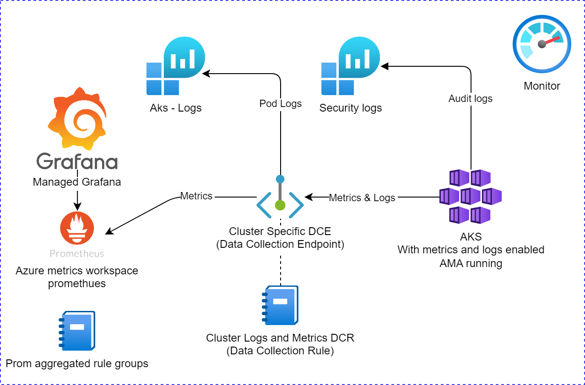

# Azure Monitor for azure kubernetes service (AKS)

This setup is for monitoring application AKS with Azure Monitor and Data Collection Rules.

## Deploy the setup

To deploy with bicep go to the [infra/bicep](infra/bicep) folder and follow the instructions in the [ReadMe.md](infra/bicep/README.md).

