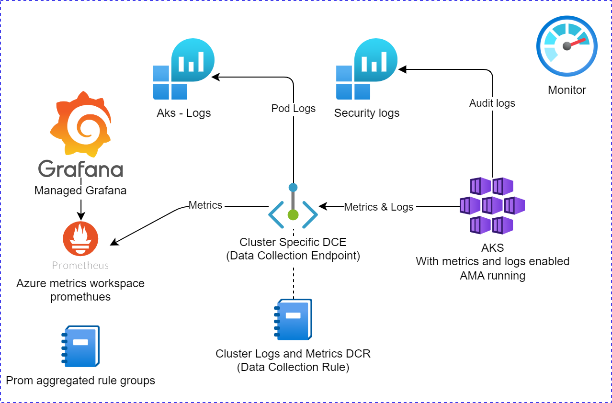

# Azure Monitor for Azure Kubernetes Service (AKS)

This setup is for monitoring applications on AKS with Azure Monitor and Data Collection Rules.

## Prerequisites

Before deploying this sample, ensure you have:

* [Azure CLI](https://docs.microsoft.com/en-us/cli/azure/install-azure-cli) - for deploying and managing Azure resources
* [kubectl](https://kubernetes.io/docs/tasks/tools/) - for managing Kubernetes clusters
* An active Azure subscription with appropriate permissions
* Basic knowledge of Azure Kubernetes Service and Kubernetes concepts

## Deploy the setup

To deploy with bicep go to the [infra/bicep](infra/bicep) folder and follow the instructions in the [ReadMe.md](infra/bicep/README.md).

