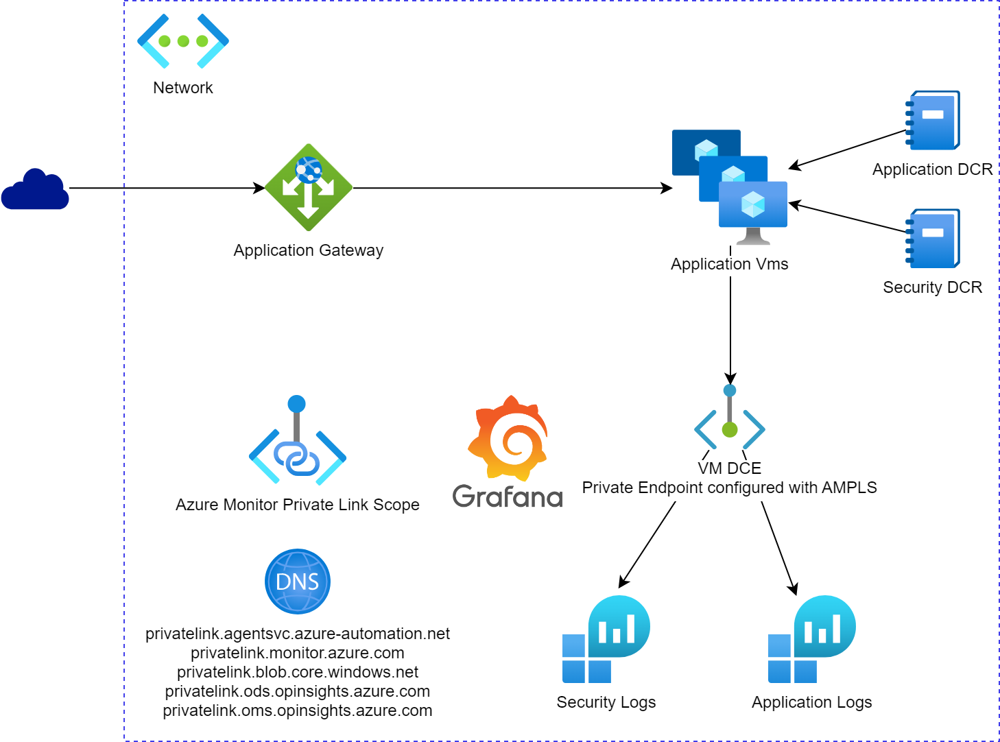

# Azure Monitor for application vms

This setup is for monitoring application vms with Azure Monitor and Data Collection Rules. The setup consists of the following components:
* 2 Data Collection Rules
  * One for collecting vm application logs and metrics 
  * One for collecting security events
* 1 Data Collection Endpoint
  * As an configuration endpoint for the vms
  * As an ingestion endpoint for the logs and metrics
* 2 Log Analytics workspaces
  * One for storing vm application logs and metrics
  * One for storing security events
* Azure Managed Grafana
* 2 windows application vms
  * Needs some manual install of tomcat and windows firewall rules
  * Extension for installing the Azure Monitor Agent
  * Extension for installing the Dependency Agent (VmInsights)
* 1 application gateway
* Network setup with Azure Monitor Private Link Scope

## Deploy the setup

To deploy with bicep go to the [infra/bicep](infra/bicep) folder and follow the instructions in the [ReadMe.md](infra/bicep/README.md).

## Use Azure Data Explorer with Log Analytics

To use Azure Data Explorer with Log Analytics you need connect to the Log Analytics workspace with the following URL given that your logged in to the Azure Data Explorer portal with a user with access to the Log Analytics workspace. The portal is https://dataexplorer.azure.com.

`https://ade.loganalytics.io/subscriptions/<subscription-id>/resourceGroups/<rg>/providers/Microsoft.OperationalInsights/workspaces/<workspace-name>`